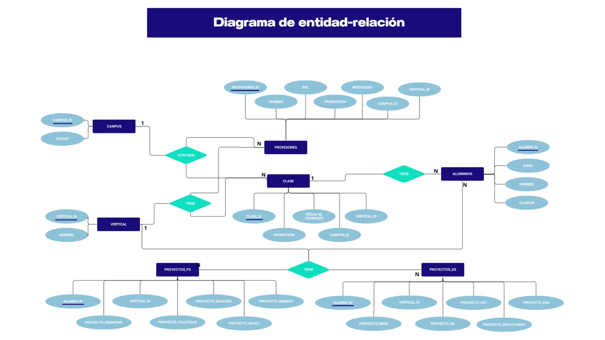
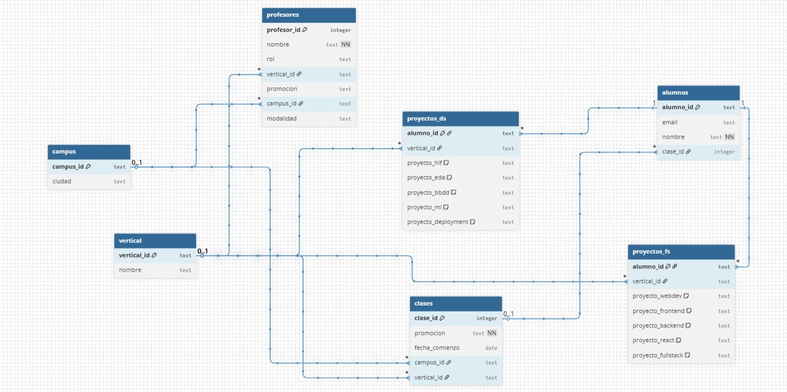

# Proyecto de Creación de Base de Datos Relacional 🗂️

Proyecto llevado a cabo en el Bootcamp de The Bridge, trabajando en grupos formados por alumnos de Data Science y Full Stack.

El proyecto tuvo como objetivo transformar datos sin normalizar de alumnos y profesores en una base de datos relacional estructurada y optimizada.

## Entregables 🗒️
1. Modelo Entidad-Relación 
2. Modelo Lógico de la Base de Datos
3. Normalización de Datos
4. Creación de la Base de Datos

## Tecnologías usadas 💻

- SQL
- PgAdmin
- Render

## Objetivo del proyecto 💡

- Diseñar y crear una base de datos relacional desde cero.

- Aplicar principios de normalización para optimizar la estructura de los datos.

- Practicar la manipulación y gestión de la información mediante consultas SQL.

- Implementar una arquitectura escalable y organizada.

- Desarrollar habilidades de trabajo en equipo y colaboración entre perfiles técnicos.

##  Modelo Entidad-Relación ⬇️

## Modelo Lógico de la Base de Datos ⬇️

### Proyecto de Git

https://github.com/luciaaroca/proyecto_SQL_G3.git

## Lecciones aprendidas 📙
- Importancia de una correcta planificación del modelo de datos antes de la implementación.

- Aplicación práctica de las formas normales para reducir la redundancia y mejorar la eficiencia.

- Trabajo colaborativo entre equipos de diferentes especialidades (Data Science y Full Stack).

- Uso de herramientas de despliegue como Render para la publicación de la base de datos.

## Autores ✍🏽

- Nombre: Lucía Aroca
- GitHub: https://github.com/luciaaroca
---

- Nombre: Luna Pérez
- GitHub: https://github.com/LunaPerezT
---
- Nombre: Jose Benegas
- GitHub:https://github.com/jbenegasb
---
- Nombre: Paula Rodriguez
- GitHub: https://github.com/PaulaGarabaya

---
- Nombre: Raquel Hernández
- GitHub: https://github.com/RaquelH18 
---
- Nombre: Rosinela Vega
- GitHub: https://github.com/Rosinela-v
---
